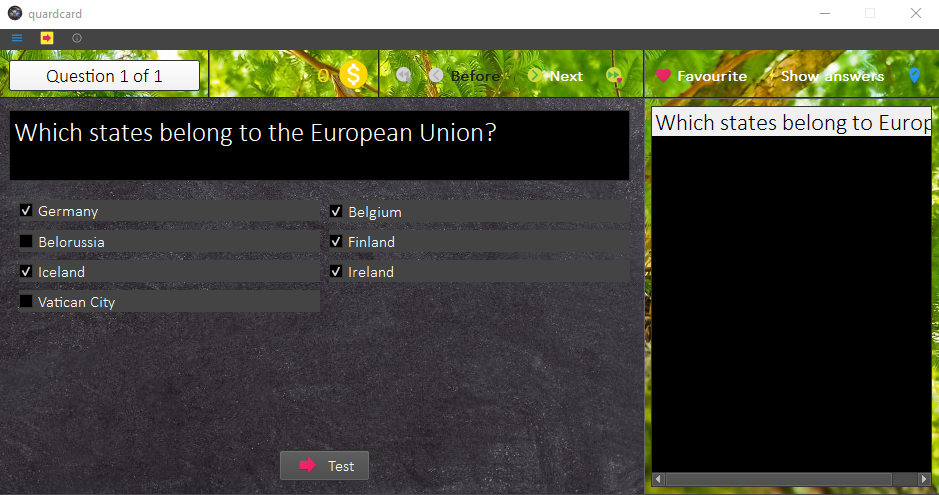

# quardcard
A learning aid

## What can I do with that?
If you need help with learning, this tool can help! It has a wide variety of functions.
You can create quardcard files with a creator, share these files to other quardcard users and help yourself to learn.

## What functionalities does the program offer?
There are a range of possibilities:
- [x] Create index cards
- [x] Create input questions
- [x] Create order questions
- [x] Create multiple choice questions
- [ ] Create true false questions
- [ ] Create game with questions

You can play as:
- [x] Single player
- [ ] Multi player

## Is it any good?
You can try it out yourself! 
You just have to **run the main.py**.

